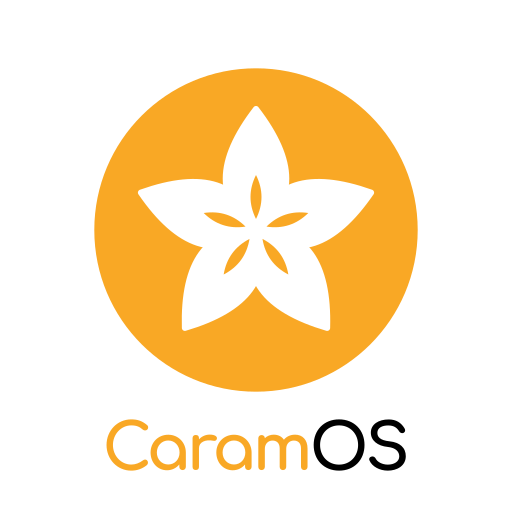

<p align="center">
  
</p>

<h1 align="center">CaramOS</h1>

<p align="center">
  <strong>Sweet & Simple Linux — A Linux distro made for Vietnamese users</strong>
</p>

<p align="center">
  <em>Caram = Carambola — the starfruit, whose 5 points mirror the star on Vietnam's flag, a fruit tied to every Vietnamese childhood</em>
</p>

<p align="center">
  <a href="README.md">Tiếng Việt</a> · <a href="https://vietnamlinuxfamily.net">VNLF</a> · <a href="https://caramos.vietnamlinuxfamily.net">Website</a>
</p>

---

### What is CaramOS?

**CaramOS** is a Linux distribution based on [Linux Mint](https://linuxmint.com/), designed specifically for **Vietnamese users**. The name comes from *Carambola* — the starfruit. Its 5-pointed cross-section mirrors the star on Vietnam's flag, and it is a fruit deeply tied to Vietnamese childhood and culture.

> Our mission is to **make Linux accessible for everyone** — everything is kept as simple as possible, software comes pre-installed and ready to use, and we strive to bring familiar Windows applications to our users.

### Key Features

| Feature | Description |
|---|---|
| **Chrome OS-style UI** | Clean, modern, rounded icons, grid launcher |
| **Caram Center** | One-click Windows app installer (Zalo, Photoshop, Office, games) |
| **Vietnamese-first** | Vietnamese locale by default, fcitx5-lotus input method, Vietnamese fonts |
| **Offline AI** | Local AI assistant — chat, translate, summarize, spell-check |
| **Safe updates** | mintupdate with risk-level classification — never breaks your system |
| **One-click backup** | Timeshift snapshots — restore in 2 minutes |
| **Auto driver detection** | Wi-Fi, GPU (NVIDIA/AMD/Intel) detected and installed automatically |
| **LAN file sharing** | Warpinator — AirDrop-like file transfer |
| **Lightweight** | Runs smoothly on low-spec hardware |

### Screenshots

> *Coming soon with the first beta release*

### Installation

1. Download ISO from [caramos.vietnamlinuxfamily.net](https://caramos.vietnamlinuxfamily.net)
2. Flash to USB with [Balena Etcher](https://etcher.balena.io) or `dd`
3. Boot from USB, follow the installer (available in Vietnamese & English)

### Caram Center — Windows Apps Made Easy

Caram Center is CaramOS's signature application that routes users to the right engine behind the scenes:

```
+------------------------------------------+
|            Caram Center                   |
+----------+----------+--------------------+
|   Apps   |  Games   |   Web Apps         |
+----------+----------+--------------------+
| Bottles  | Lutris   | Webapp Manager     |
| (Wine)   | (Wine)   | (PWA)              |
+----------+----------+--------------------+
```

| App | Method | Status |
|---|---|---|
| **Zalo** | Snap / PWA | Works well |
| **Photoshop CS6** | Bottles (Wine) | Works well |
| **MS Office 2016** | Bottles (Wine) | Basic OK |
| **Windows Games** | Lutris / Steam Proton | Varies |

### Tech Stack

| Component | Technology |
|---|---|
| **Base** | Linux Mint (Cinnamon) |
| **GTK Theme** | ChromeOS-theme by vinceliuice |
| **Icons** | Tela Circle |
| **Launcher** | Cinnamenu (grid layout) |
| **Windows Apps** | Bottles + Wine |
| **Windows Games** | Lutris + Wine |
| **Web Apps** | Webapp Manager (PWA) |
| **Input Method** | fcitx5-lotus (Vietnamese) |
| **AI** | Ollama (Gemma 2B / Phi-3 Mini) |
| **Backup** | Timeshift |
| **Updates** | mintupdate |

### Contributing

We welcome contributions! See [CONTRIBUTING_EN.md](CONTRIBUTING_EN.md) for guidelines.

1. Fork this repo
2. Create a new branch (`git checkout -b feature/my-feature`)
3. Commit changes (`git commit -m 'Add new feature'`)
4. Push to branch (`git push origin feature/my-feature`)
5. Create a Pull Request

**You can help with:**
- Bug reports and feature suggestions via [Issues](https://github.com/VN-Linux-Family/CaramOS/issues)
- Wallpaper, icon, and theme design
- Testing on different hardware
- Documentation and translations
- Writing Windows app install scripts for Caram Center

### License

CaramOS is open-source software licensed under [GPL-3.0](LICENSE).

### Acknowledgments

- [Linux Mint](https://linuxmint.com/) — Outstanding base distribution
- [VNLF (Vietnam Linux Family)](https://vietnamlinuxfamily.net) — Vietnamese Linux community
- [vinceliuice](https://github.com/vinceliuice) — ChromeOS-theme, Tela Circle icons
- [Bottles](https://usebottles.com/) — Run Windows apps on Linux
- [Lutris](https://lutris.net/) — Run Windows games on Linux
- [Ollama](https://ollama.com/) — Offline AI

---

<p align="center">
  <strong>CaramOS</strong> — Sweet & Simple Linux<br>
  Made with love by <a href="https://vietnamlinuxfamily.net">Vietnam Linux Family</a>
</p>
